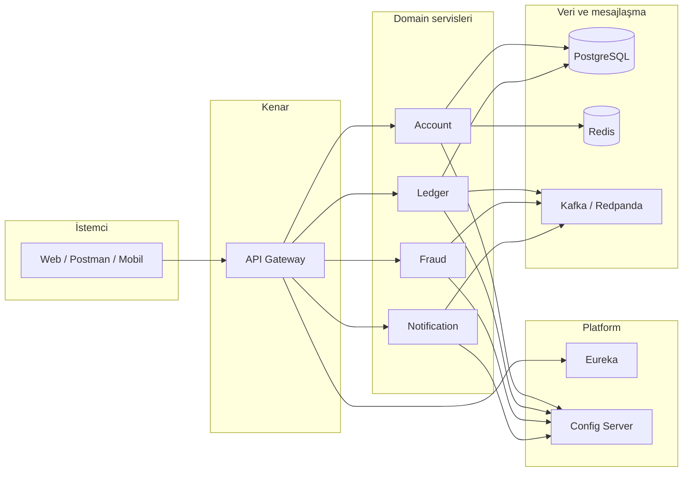
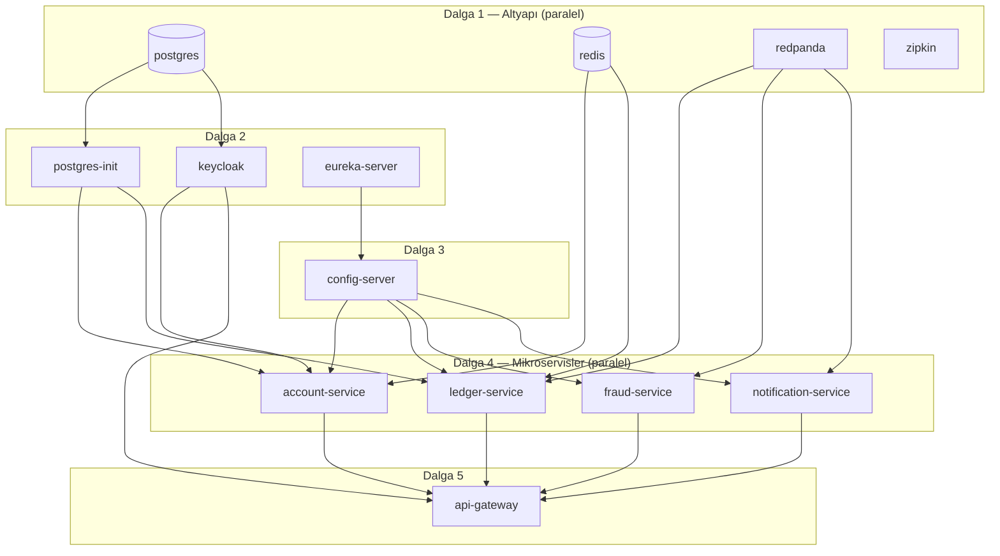

# Java Microservices Project

Yüksek eşzamanlılık ve dağıtık dayanıklılık hedefleriyle tasarlanmış, **Spring Boot 3** ve **Spring Cloud** tabanlı bir **para transferi ve hesap yönetimi** mikroservis sistemidir. İstemci trafiği API Gateway üzerinden yönlendirilir; iş kuralları domain servislerine ayrılmıştır; **Kafka** ile asenkron entegrasyon, **Redis** ile önbellek ve hız sınırı, **PostgreSQL** ile kalıcılık, **Keycloak** ile kimlik doğrulama kullanılır.

> **Ek dokümantasyon:** Derinlemesine akışlar, Docker adımları, case study karşılaştırması ve mimari notlar için [`README/`](README/) klasöründeki Markdown raporlarına bakın (aşağıda indekslenmiştir).

---

## İçindekiler

- [Özellikler](#özellikler)
- [Teknoloji yığını](#teknoloji-yığını)
- [Modül yapısı](#modül-yapısı)
- [Mimari genel bakış](#mimari-genel-bakış)
- [Docker Compose başlatma sırası](#docker-compose-başlatma-sırası)
- [Para transferi akışı (özet)](#para-transferi-akışı-özet)
- [Hızlı başlangıç](#hızlı-başlangıç)
- [Portlar ve adresler](#portlar-ve-adresler)
- [Yapılandırma](#yapılandırma)
- [README rapor indeksi](#readme-rapor-indeksi)

---

## Özellikler

| Alan | Açıklama |
|------|-----------|
| **Hesap yönetimi** | Kayıt, giriş, profil; hesap listesi ve detay. Redis ile hesap okuma önbelleği. |
| **Defter (ledger)** | IBAN bazlı bakiye; transfer başlatma, fraud sonrası atomik bakiye güncellemesi. |
| **Idempotency** | `transferId` ile tekrarlayan isteklerde çift işlem engeli (`TransferInitService`). |
| **Eşzamanlı transfer** | Optimistic locking ve sürüm kontrollü SQL güncellemeleri (`TransferProcessService`, `LedgerRepository`). |
| **Fraud** | Kafka üzerinden asenkron fraud kontrolü; Resilience4j circuit breaker. |
| **Bildirim** | Transfer tamamlanınca Kafka ile tetiklenen bildirim servisi. |
| **API Gateway** | Spring Cloud Gateway, Eureka tabanlı `lb://` yönlendirme, circuit breaker fallback’leri, isteğe bağlı Redis rate limit. |
| **Gözlemlenebilirlik** | Zipkin / Micrometer tracing (yapılandırma servislere göre); Actuator health. |
| **Merkezi hata modeli** | Paylaşılan exception tipleri ve HTTP eşlemesi (`GlobalExceptionHandlerLib`). |

Case study ve iyileştirme özetleri için bkz. [`README/CASE_STUDY_EVALUATION_UPDATED.md`](README/CASE_STUDY_EVALUATION_UPDATED.md).

---

## Teknoloji yığını

- **Java 21**, **Gradle** (çok modüllü proje)
- **Spring Boot 3.0.x**, **Spring Cloud 4.0.x** (kök `build.gradle` içinde `versions` / `libs` ile sabitlenmiş sürümler)
- **Spring Cloud Netflix Eureka** — servis keşfi
- **Spring Cloud Config** — yerel `native` profil ile `classpath:/config-repo` üzerinden ortak YAML
- **Spring Cloud Gateway** (WebFlux), **OAuth2 Resource Server** (JWT / Keycloak JWK)
- **Apache Kafka** (geliştirme / compose tarafında **Redpanda** ile uyumlu kullanım)
- **PostgreSQL**, **Redis**
- **Keycloak** — kullanıcı yönetimi ve token (Account servisi entegrasyonu)
- **Resilience4j**, **Spring Retry** (seçili dış çağrılarda)
- **OpenAPI / Springdoc** — API dokümantasyonu (Gateway üzerinden toplanan URL’ler)

---

## Modül yapısı

| Modül | Rol |
|--------|-----|
| `ConfigServerLocal` | Merkezi yapılandırma sunucusu (`8888`). |
| `DashboardEurekaServer` | Eureka + Spring Boot Admin odaklı keşif paneli (`8761`). |
| `ApiGatewayService` | Tek giriş noktası; güvenlik ve route filtreleri (`80` veya `SERVER_PORT`). |
| `AccountService` | Kullanıcı / hesap API’leri, Keycloak, Redis cache. |
| `LedgerService` | Transfer başlatma, Kafka producer/consumer, optimistic locking ile bakiye. |
| `FraudService` | Fraud Kafka consumer, circuit breaker. |
| `NotificationService` | Tamamlanan transferler için bildirim tüketicisi. |
| `GlobalExceptionHandlerLib` | Ortak exception sınıfları (JAR olarak diğer servislere bağımlılık). |

Modül listesi `settings.gradle` dosyasında tanımlıdır.

---

## Mimari genel bakış



---

## Docker Compose başlatma sırası

`docker compose up -d` tek komutla tüm yığını başlatır. Compose, `depends_on` ve **healthcheck** ile servisleri dalgalar halinde ayağa kaldırır; böylece mikroservisler veritabanı / Kafka / Keycloak hazır olmadan açılmaz, API Gateway de backend’ler **healthy** olduktan sonra başlar.

### Dalga diyagramı



### Servis bağımlılıkları (özet)

| Servis | Beklediği koşullar |
|--------|-------------------|
| `postgres-init` | `postgres` **healthy** |
| `keycloak` | `postgres` **healthy** (+ kendi healthcheck, ~1–2 dk) |
| `eureka-server` | Bağımsız (ilk platform servisi) |
| `config-server` | `eureka-server` **healthy** |
| `account-service` | DB init tamam, `redis` + `keycloak` **healthy**, config + eureka **healthy** |
| `ledger-service` | DB init, `redis` + `redpanda` **healthy**, config + eureka **healthy** |
| `fraud-service` / `notification-service` | `redpanda` **healthy**, config + eureka **healthy** |
| `api-gateway` | Tüm mikroservisler + `keycloak` + `redis` **healthy** |

### Healthcheck notları

| Bileşen | Kontrol |
|---------|---------|
| PostgreSQL | `pg_isready` |
| Redis | `redis-cli ping` |
| Redpanda | `rpk cluster health` |
| Keycloak | `/health/ready` (TCP) |
| Eureka / Config / mikroservisler / Gateway | `curl` → `/actuator/health` |
| Zipkin | `wget` → `/health` |

İlk `docker compose up` sonrası Keycloak ve Spring Boot uygulamalarının tam hazır olması **2–4 dakika** sürebilir. Durum için:

```bash
docker compose ps
docker compose logs -f api-gateway
```

Ayrıntılı Docker adımları ve sorun giderme: [`README/DOCKER_DEPLOYMENT_GUIDE.md`](README/DOCKER_DEPLOYMENT_GUIDE.md).

---

## Para transferi akışı (özet)

1. **Ledger** transfer isteğini doğrular, deftere kayıt açar, **Kafka** üzerinden fraud kuyruğuna yollar.
2. **Fraud** mesajı işler, sonucu sonuç konusuna yazar.
3. **Ledger** sonucu tüketir: başarılıysa **optimistic locking** ile bakiye güncellenir; başarısızlıkta tutarlı geri alma ve anlamlı HTTP hataları (`InsufficientBalanceException`, `OptimisticLockException`, vb.).
4. **Notification** tamamlanan transfer olayını işler.

Konu adları ve basit sıra diyagramı: [`README/KAFKA_REDIS_AKIS_BASIT.md`](README/KAFKA_REDIS_AKIS_BASIT.md). Daha ayrıntılı Kafka/Redis raporu: [`README/KAFKA_REDIS_USAGE_REPORT.md`](README/KAFKA_REDIS_USAGE_REPORT.md).

---

## Hızlı başlangıç

### Gereksinimler

- **JDK 21**
- **Docker** ve **Docker Compose** (tam yığın için)
- İsteğe bağlı: yerel **PostgreSQL**, **Redis**, **Kafka**, **Keycloak** (Docker kullanmadan çalıştıracaksanız ilgili `application.yml` / ortam değişkenlerini proje yorumlarına göre ayarlayın)

### Derleme

```bash
# Windows
.\gradlew.bat clean build -x test

# Linux / macOS
./gradlew clean build -x test
```

### Docker ile tüm stack

Önerilen sıra ve sorun giderme: [`README/DOCKER_DEPLOYMENT_GUIDE.md`](README/DOCKER_DEPLOYMENT_GUIDE.md).

```bash
cp .env.example .env   # sifreleri ve MAIL_* / KEYCLOAK_* duzenleyin
docker compose up -d --build
```

Compose, [başlatma sırasına](#docker-compose-başlatma-sırası) göre servisleri sırayla açar. İlk kurulumda Keycloak ve tüm Spring servislerinin **healthy** olması birkaç dakika sürebilir; `docker compose ps` ile `healthy` durumunu kontrol edin.

### Yerel IDE (kısaltılmış)

1. Altyapıyı (Postgres, Redis, Kafka, Keycloak, Zipkin) Docker veya yerel olarak ayağa kaldırın.
2. **Eureka** → **Config Server** → diğer servisler → **Gateway** sırasıyla başlatın.
3. Gateway varsayılan **80** portunu kullanır; Windows’ta yönetici izni gerekebilir — `SERVER_PORT=9080` gibi bir port ile `ApiGatewayService` çalıştırıp istemci ve Ledger’deki gateway taban URL’lerini buna göre güncellemeniz gerekebilir.

---

## Portlar ve adresler

Docker ve host eşlemelerinin tam tablosu için: [`README/DOCKER_DEPLOYMENT_GUIDE.md`](README/DOCKER_DEPLOYMENT_GUIDE.md#-servis-erişim-portları).

| Bileşen | Tipik host portu |
|---------|------------------|
| API Gateway | 80 |
| Eureka | 8761 |
| Config Server | 8888 |
| Account | 9591 |
| Ledger | 9592 |
| Fraud | 9593 |
| Notification | 9594 |
| Keycloak (host) | 8180 |
| Zipkin | 9411 |
| PostgreSQL (compose host eşlemesi dokümana göre) | 9999 |
| Redis | 6379 |
| Kafka (Redpanda) | 9092 |

---

## Yapılandırma

- **Config Server:** `ConfigServerLocal/src/main/resources/config-repo/*.yml` altında servis başına profiller.
- **Yerel bootstrap:** Birçok serviste `optional:configserver:` ile Config Server yokken bile sınırlı ayakta kalma.
- **Ortam değişkenleri:** Docker Compose içinde Eureka, Redis, Keycloak JWK URI, Kafka bootstrap vb. override edilir; ayrıntılar yine Docker rehberinde.

---

## README rapor indeksi

| Dosya | İçerik |
|--------|--------|
| [DOCKER_DEPLOYMENT_GUIDE.md](README/DOCKER_DEPLOYMENT_GUIDE.md) | Docker build, compose, portlar, sorun giderme, kontrol listesi |
| [KAFKA_REDIS_AKIS_BASIT.md](README/KAFKA_REDIS_AKIS_BASIT.md) | Kafka konuları, Redis (cache + rate limit) kısa özet |
| [KAFKA_REDIS_USAGE_REPORT.md](README/KAFKA_REDIS_USAGE_REPORT.md) | Kafka ve Redis kullanımının ayrıntılı raporu |
| [OPTIMISTIC_LOCKING_OZET.md](README/OPTIMISTIC_LOCKING_OZET.md) | Ledger’da optimistic locking ve sürüm güncellemeleri |
| [SAGA_PATTERN_ANALYSIS.md](README/SAGA_PATTERN_ANALYSIS.md) | Saga / dağıtık işlem notları ve analiz |
| [CASE_STUDY_EVALUATION.md](README/CASE_STUDY_EVALUATION.md) | Case study karşılaştırması (özet + tarihsel iyileştirme notları) |
| [CASE_STUDY_EVALUATION_UPDATED.md](README/CASE_STUDY_EVALUATION_UPDATED.md) | Güncellenmiş gereksinim matrisi ve kalan işler |

PDF case study metni varsa: `README/Case Study.pdf` (depoda mevcutsa).

---

## Katkı ve lisans

Bu depo eğitim ve referans amaçlı bir mikroservis iskeletidir. Üretim kullanımından önce güvenlik sertleştirmesi, test kapsamı, yük testleri ve gizli anahtarların ortam değişkenleri / secret store ile yönetimi zorunludur.

---

**Özet:** Proje, finansal transfer senaryosuna uygun ayrılmış servisler, merkezi config, keşif, gateway ve mesaj odaklı entegrasyon sunar; tutarlılık ve tekrarlanabilirlik için idempotency ve optimistic locking vurgulanmıştır. Operasyonel ve mimari detaylar için yukarıdaki `README/` raporlarını kullanın.
